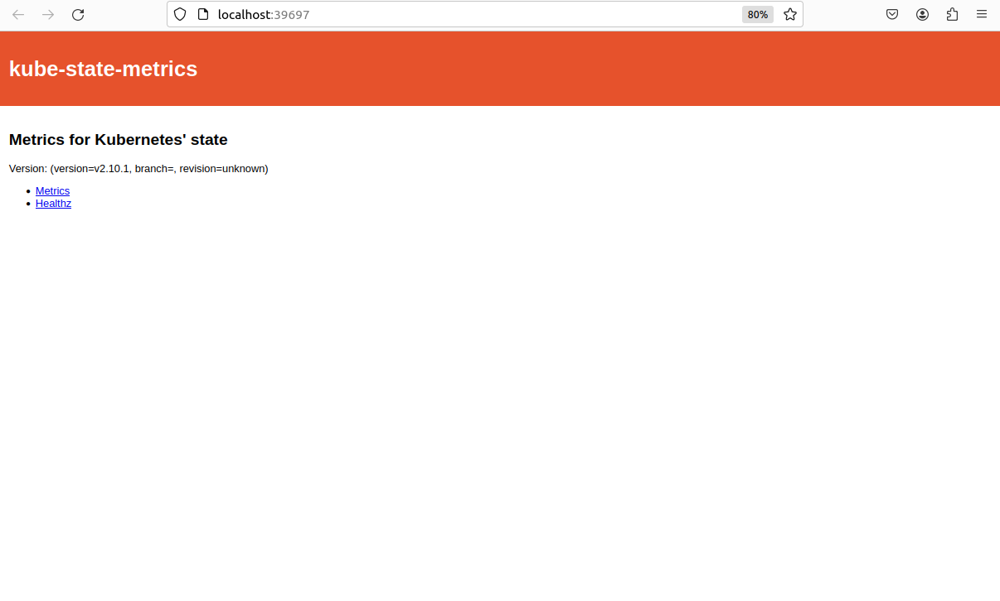
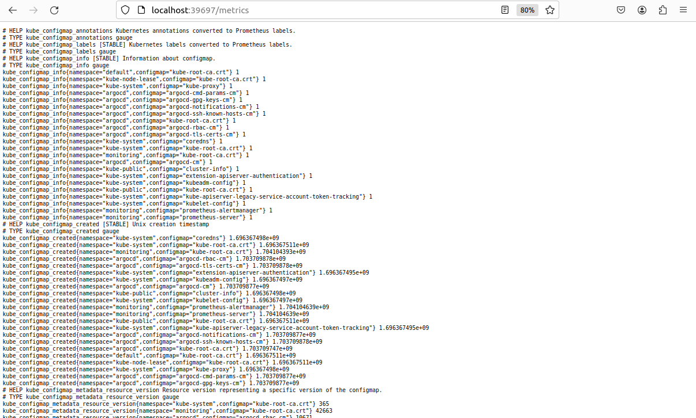
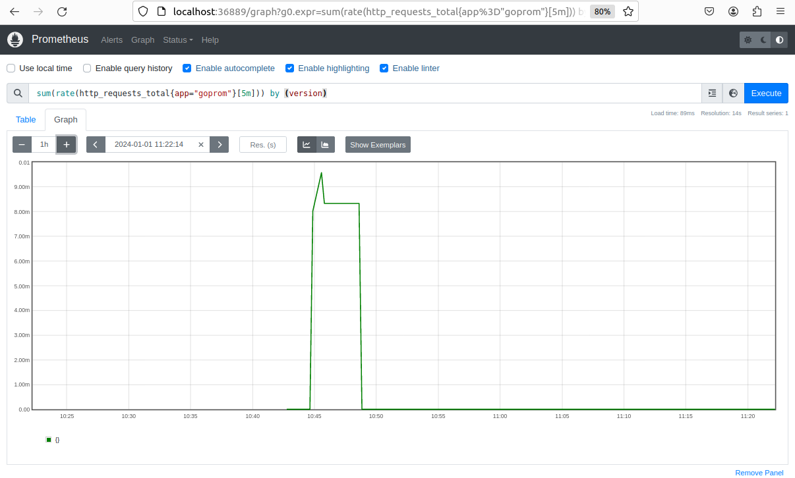
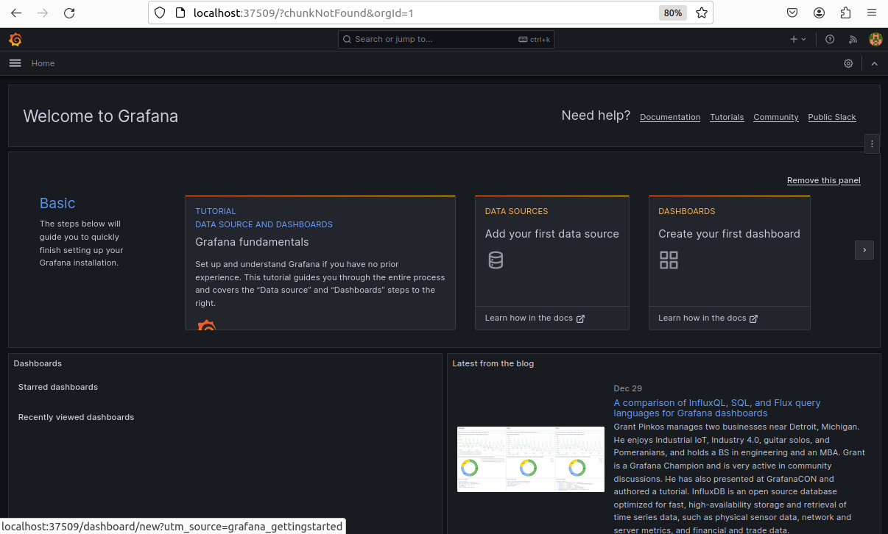
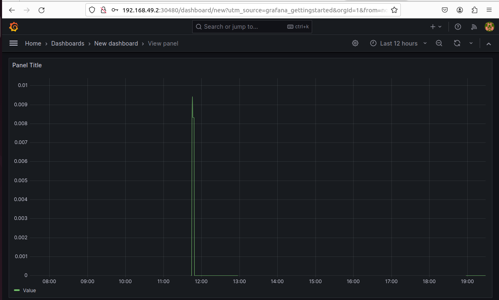

# Monitoring-Devops
Tout d'abord j'ai suivi le tp et j'ai faire tous les commandes de l'installer de Prometheus avec Helm et le monitoring du cluster et les étapes pour le déployement de notre application. Voici les captures suivante:

L'interface de service goprom

L'interface de service goprom-metrics

voila la capture pour  vérifiée que prometheus récupère bien les métriques de l’application avec la requête PromQL :

Et derniérement étape j'ai installer et configurer Grafana pour visualiser les requêtes :

Connection a grafana :   

L'ajout de DataSource : 

et finalement la visualisation du graph :

